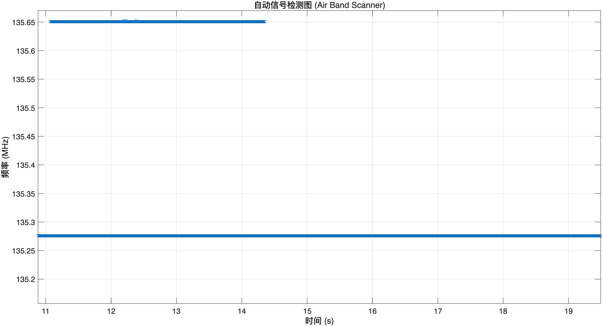
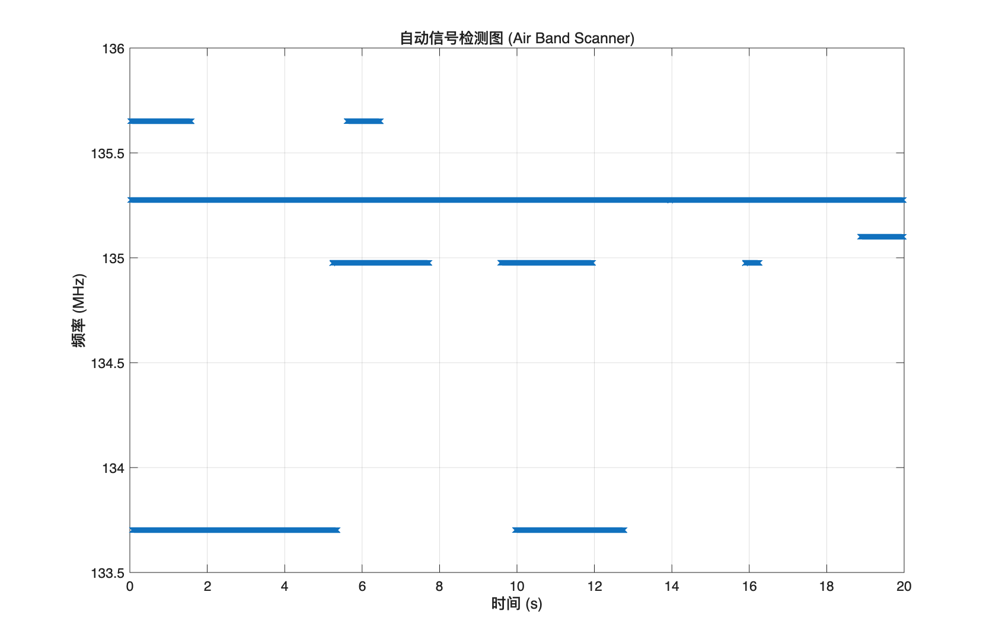
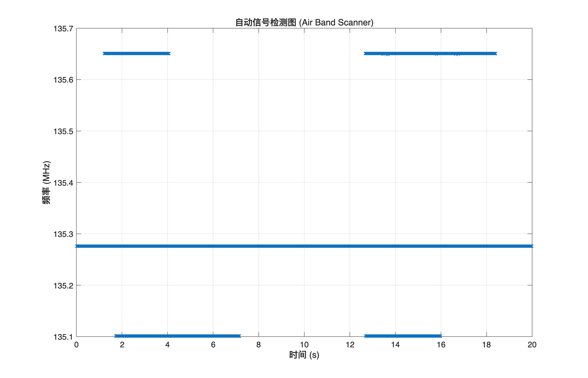
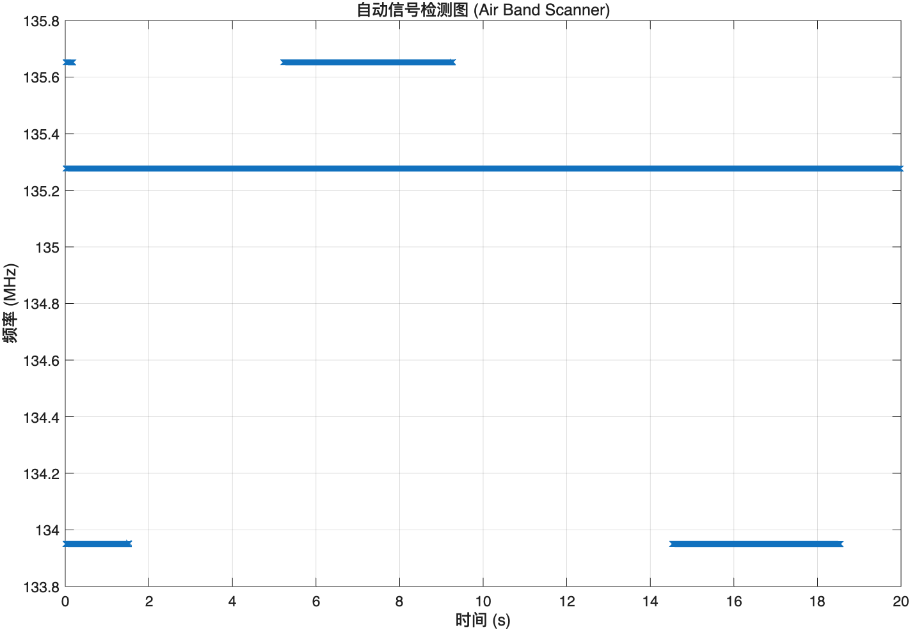
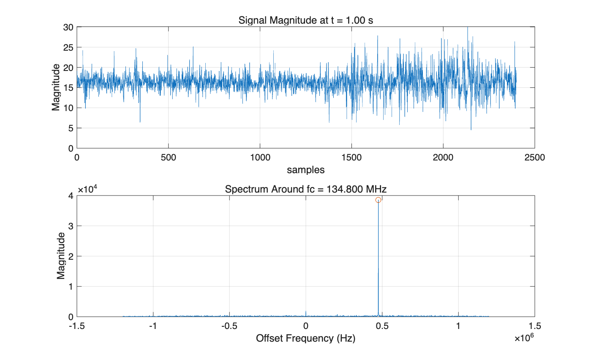
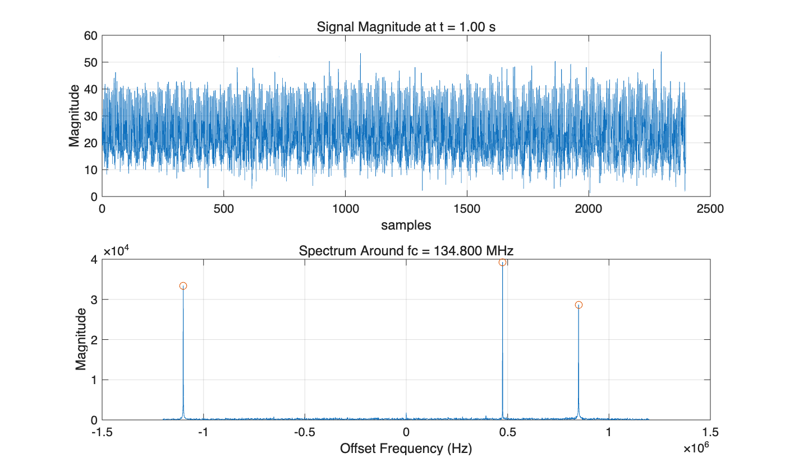
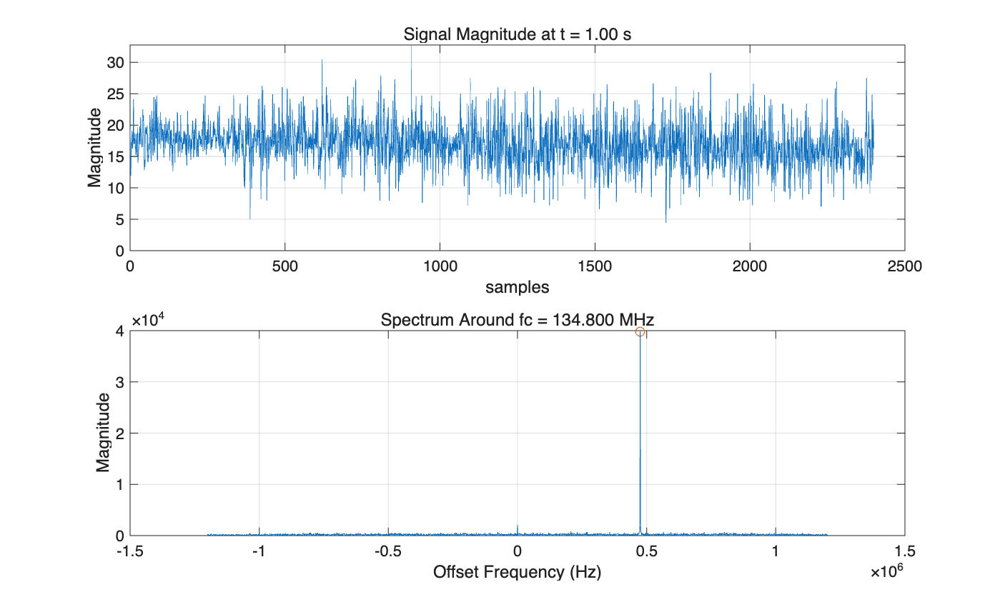
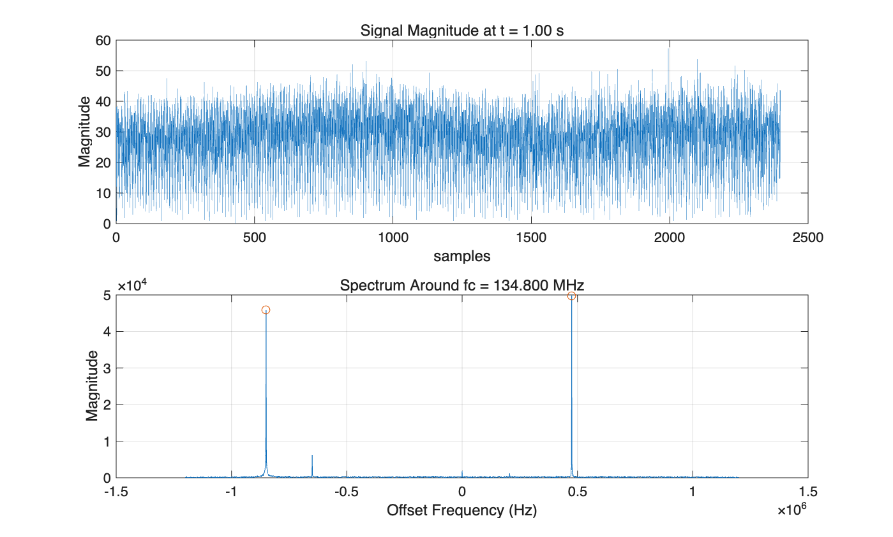
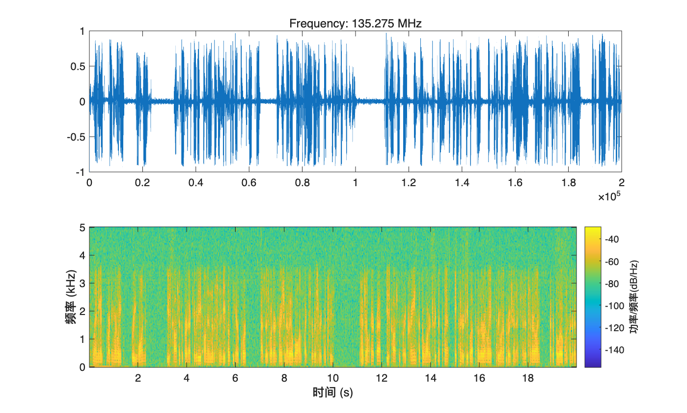
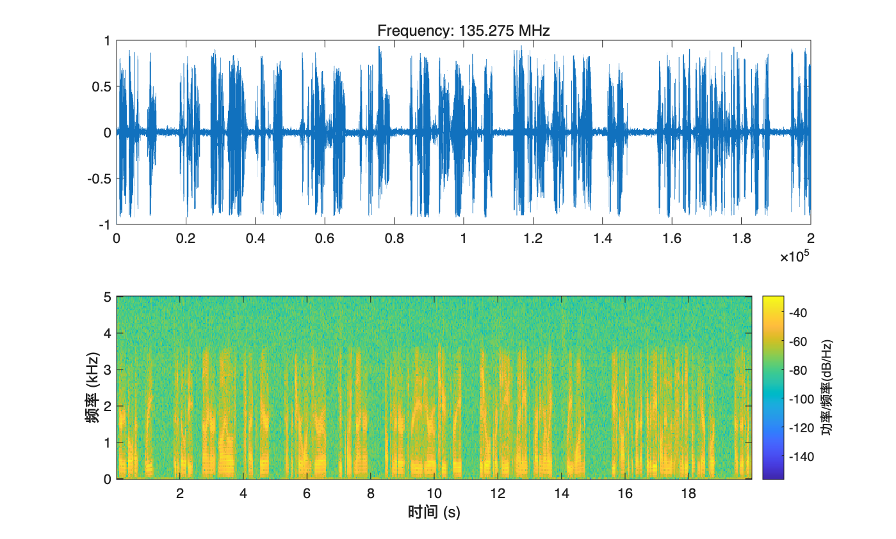

# EE121 Lab 2 Report

## Automatic Air-Band Signal Detection, Extraction, and Transcription

### 1. Objective

The goal of this lab was to process wideband RTL-SDR air-band recordings centered at `fc = 134.8 MHz` with sampling rate `fs = 2.4 MHz`, then:

1. demodulate and listen to the whole band at once,
2. detect active signals in time and frequency,
3. extract each detected channel automatically,
4. optionally transcribe the extracted audio.

This project was implemented with MATLAB for signal processing and a standalone Python Whisper script for transcription.

### 2. Files Used

- Whole-band playback: [playEntireBand.m](playEntireBand.m)
- Signal detection: [findSignals.m](findSignals.m)
- Signal extraction: [scanAndExtract.m](scanAndExtract.m)
- End-to-end automation: [run.m](run.m)
- Optional transcription: [transcribe_whisper.py](transcribe_whisper.py)
- Windowed-sinc filter design: [wsinc.m](wsinc.m), [designLowpassDemo.m](designLowpassDemo.m)

### 3. Low-Pass Filter Design

To reduce the sample rate from `2.4 MHz` to `10 kHz`, the decimation factor is:

`240 = 2.4e6 / 1e4`

The lab specifies a low-pass filter with:

- passband bandwidth `BW = 9.5 kHz`
- transition width `0.5 kHz`

Using the approximation

`transition width ≈ 2(BW) / TBW`

we get

`TBW = 2 * 9500 / 500 = 38`

The filter duration is

`T = TBW / BW = 38 / 9500 = 0.004 s = 4 ms`

At `fs = 2.4 MHz`, the number of samples is

`samples = T * fs = 0.004 * 2.4e6 = 9600`

This confirms the lab's point: a direct windowed-sinc design works in theory, but is inefficient for decimation by 240. For that reason, the project uses MATLAB's `dsp.FIRDecimator(240)` in practice.

### 4. Whole-Band Playback

The function `playEntireBand(data, fs)` demodulates the whole captured band by envelope detection:

1. take `abs(data)` to get the AM envelope,
2. decimate by 240 using `dsp.FIRDecimator`,
3. play the resulting audio with `soundsc`.

This returns the audio waveform and now also plots the full-band demodulated audio, matching the required lab task.

### 5. Signal Detection

The function `findSignals(data, fs, fc)` scans the data every `2400` samples, exactly as required by the lab. For each block:

1. compute an FFT with 1 kHz resolution,
2. apply `fftshift`,
3. use `findpeaks(..., 'MinPeakProminence', 1e4)` to detect strong carriers,
4. convert FFT-bin location into offset frequency and actual carrier frequency.

The function returns:

- `times`: signal appearance times
- `freqs`: actual RF frequencies in Hz
- `offsets`: frequencies relative to the center frequency `fc`

### 6. Automatic Extraction

The function `scanAndExtract(data, fs, fc)` automatically extracts each detected channel and stores the result in a MATLAB structure:

```matlab
S(i) = struct('time', t0, 'freq', f_target, 'audio', audio_final);
```

The extraction path is:

1. find candidate frequencies,
2. frequency-shift the target to baseband,
3. decimate first,
4. apply envelope detection after decimation,
5. store time, frequency, and audio.

This follows the lab hint that `abs()` should be applied **after** decimation for individual channels.

### 7. Optional Automatic Transcription

The optional extension was completed using Whisper through an external Python helper rather than MATLAB's in-process Python interface. This was more stable on macOS and avoided library conflicts with MATLAB's OpenSSL environment.

The workflow is:

1. MATLAB saves each extracted message as a `.wav`,
2. MATLAB calls [transcribe_whisper.py](transcribe_whisper.py),
3. Python runs Whisper and writes the transcript,
4. MATLAB stores the transcript in the final text report for each signal.

### 8. Results

#### 8.1 Data Set Summaries

The following summary figures show the extracted signals for the four available data sets used in this project:









#### 8.2 Detection Window Examples

To match the frequency-detection procedure described in the lab handout, a separate example figure was generated for each data set using one `2400`-sample window (`1 kHz` frequency resolution). Each figure shows:

1. the time-domain magnitude of the selected signal segment,
2. the FFT magnitude spectrum of that segment,
3. the detected spectral peaks marked by circles.









#### 8.3 Example Extracted Signal Figures

Example channel plots automatically saved by `run.m`:





#### 8.4 Example Detected Frequencies and Transcripts

For Data Set 4, the system found these representative channels:

| Start time (s) | Frequency (MHz) | Example transcript |
|---|---:|---|
| 0.00 | 133.950 | "7000 has got 3417..." |
| 0.01 | 133.955 | "7 hours to go, 34-17..." |
| 0.01 | 135.275 | ATIS-like weather broadcast |
| 0.01 | 135.650 | Short pilot/controller exchange |
| 0.01 | 135.655 | Short pilot/controller exchange |

For Data Set 3, the continuously detected `135.275 MHz` channel was clearly the strongest ATIS-style transmission, which agrees with the waterfall and extracted audio results.

### 9. Discussion

The system successfully detected active air-band channels and extracted intelligible audio from each one. The strongest continuously present channel was the ATIS broadcast near `135.275 MHz`, while shorter aircraft transmissions appeared intermittently at nearby frequencies.

The optional transcription stage worked well enough to show message content, but it was not perfectly accurate. This is expected because air-band AM speech contains noise, interference, clipped speech, accents, and aviation phraseology that a general-purpose speech model does not always decode cleanly.

The most important success of the lab is that the full pipeline works automatically:

1. detect signals in time and frequency,
2. isolate each one,
3. demodulate and save audio,
4. produce plots and transcripts.

### 10. Completion Check

Based on the official lab requirements, the project status is:

- Completed: whole-band playback function
- Completed: signal detection function
- Completed: automatic signal extraction into a structure
- Completed: extracted signal plots
- Completed: frequencies and times reported for multiple data sets
- Completed: optional automatic transcription
- Completed after patching: scan interval changed to every 2400 samples
- Completed after patching: low-pass design code added with `wsinc.m`

One small note: the low-pass design section is now implemented in code, but if you want that part to appear as generated figures in the final submission, you should run:

```matlab
designLowpassDemo
```

and save the two generated plots if your instructor expects them explicitly in the report.


### 11. Conclusion

This lab produced an automatic air-band scanner pipeline in MATLAB. The program can process wideband recordings, detect active signals, determine their carrier frequencies, extract each message, and optionally transcribe the audio. The required core objectives of the lab were achieved, and the optional transcription extension was also completed.
