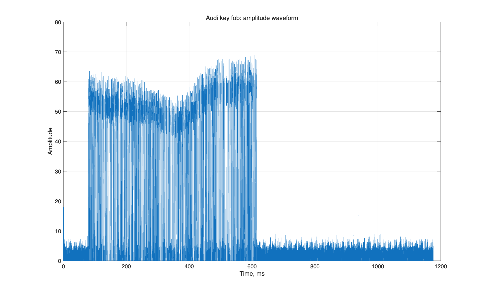
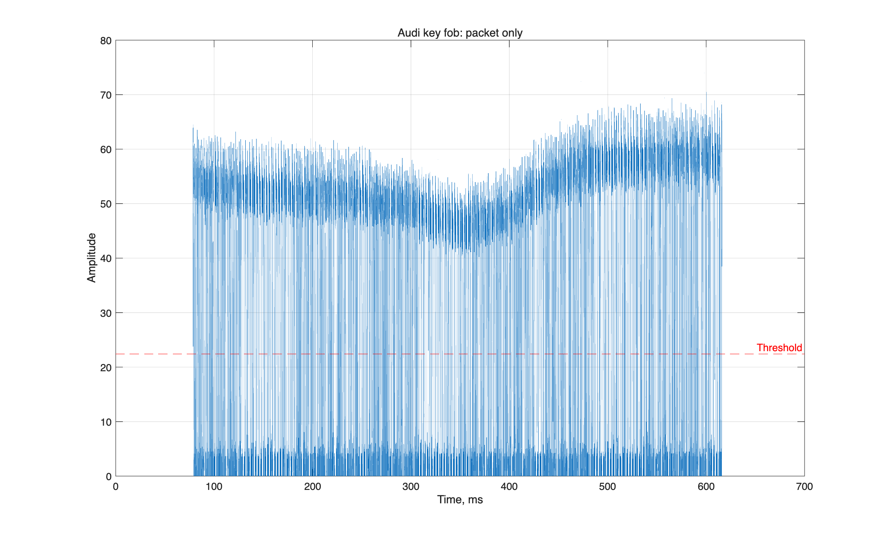
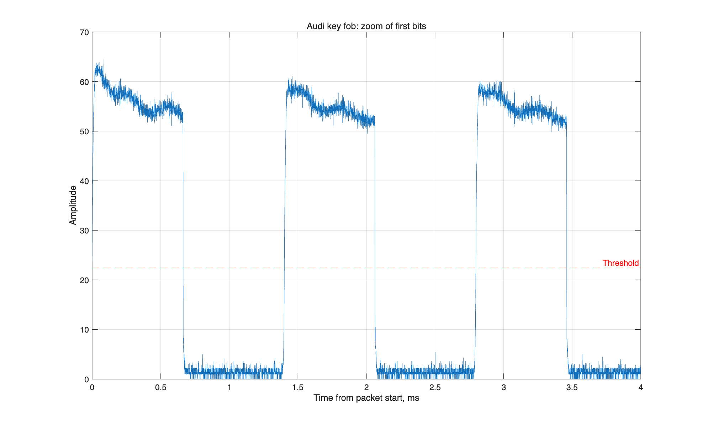
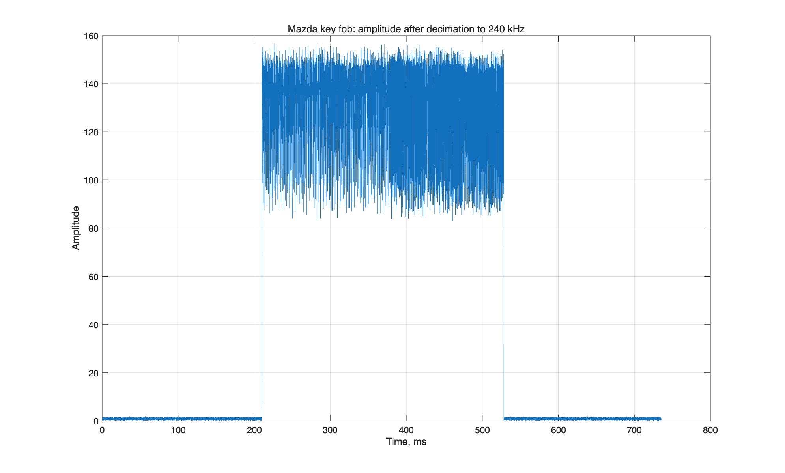
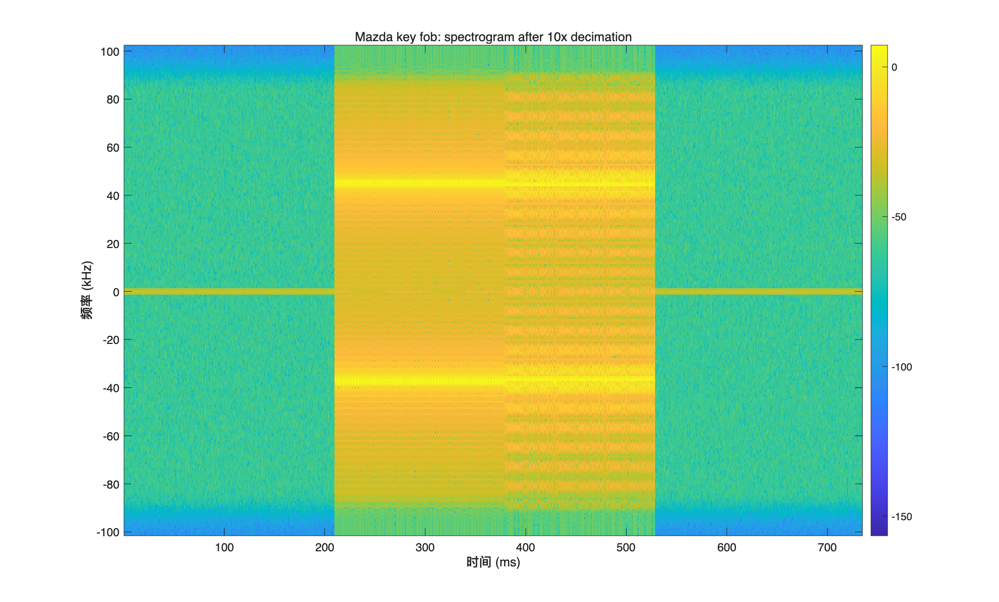
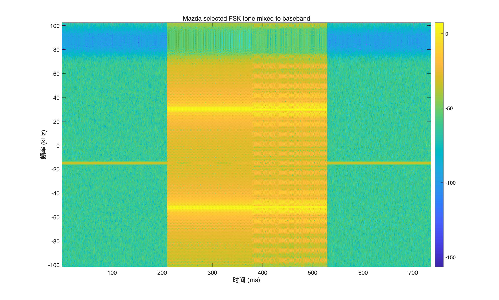
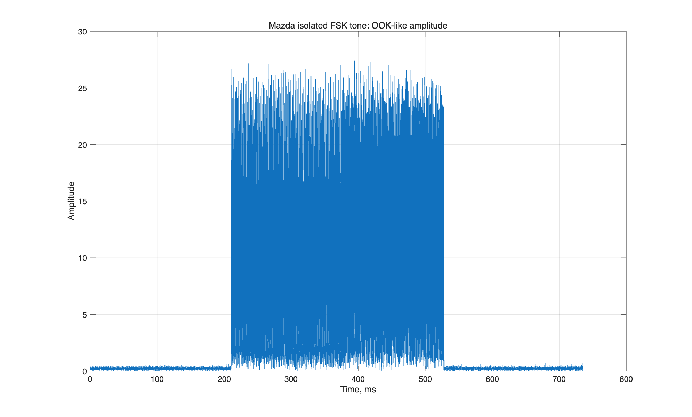
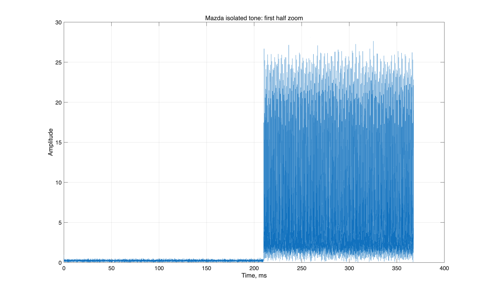
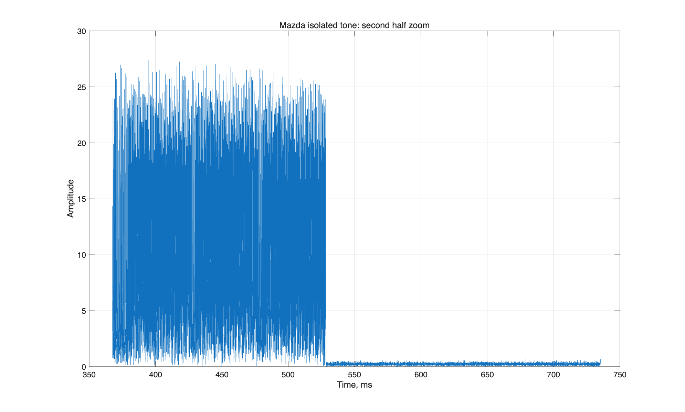

# EE121 Lab 5 实验报告：Car Key Fobs

## 一、实验目的

本实验的目标是分析汽车遥控钥匙（key fob）的数字通信信号。实验主要观察两种不同的编码方式：

1. Audi key fob 使用的 OOK（On-Off Keying）信号；
2. Mazda key fob 使用的 FSK（Frequency Shift Keying）信号。

通过对信号的时域波形、幅度包络和频谱图进行分析，可以判断信号的调制方式，并估计 bit time、bit 数量以及 FSK 频率特征。

## 二、Audi Signal 分析

### 1. 时域波形

首先读取 `audi_key.mat` 中的信号，并绘制其幅度：



从图中可以看到，Audi 遥控钥匙信号具有明显的脉冲结构。信号幅度在高、低两个状态之间切换，因此它属于 OOK 信号。OOK 的特点是载波存在时表示一种状态，载波不存在或幅度很低时表示另一种状态。

进一步截取有效 packet 部分：



可以看到有效数据包由一串密集的高低脉冲组成。根据实验说明，这个信号不是简单地用高电平表示 1、低电平表示 0，而是使用 split-phase / Manchester-like 编码。也就是说，bit 信息主要由跳变方向表示。

### 2. 局部放大

对 packet 开头部分进行放大：



从局部图中可以看到，每个 bit 大约由两个 pulse 时间组成。信号中频繁出现高低跳变，这符合 Manchester 编码的特点。Manchester 编码的优点是每个 symbol 内部都有跳变，因此接收端更容易进行同步和检测。

### 3. Audi 信号参数估计

MATLAB 脚本输出的估计结果为：

```text
Audi threshold: 22.407
Audi estimated half-bit pulse: 1356.5 samples = 664.951 us
Audi estimated bit time: 1329.902 us
Audi estimated number of bits: 404
```

因此，Audi 信号的近似参数为：

- 判决门限约为 `22.407`
- 半个 bit 的 pulse 时间约为 `664.951 us`
- 一个 bit 的时间约为 `1329.902 us`
- 整个信号大约包含 `404 bits`

这些数值是通过对幅度包络进行门限判决，并统计高低电平 run length 得到的近似估计。

## 三、Mazda Signal 分析

### 1. Decimation 后的时域幅度

Mazda 信号首先被降采样到 240 kHz，然后绘制幅度：



从时域幅度图可以看到，Mazda 信号不像 Audi 信号那样表现出清晰的 OOK 高低幅度结构。信号整体幅度变化不能直接对应 bit 0 或 bit 1。因此，仅从幅度图来看，它并不是典型的 OOK 编码。

### 2. Spectrogram 分析

为了观察频率随时间的变化，绘制 spectrogram：



从频谱图中可以看到，信号主要在两个不同频率之间切换。这说明 Mazda key fob 使用的是 FSK 调制方式。FSK 中，一个频率表示 bit 1，另一个频率表示 bit 0。

实验说明中指出两个频率大约相差 `96 kHz`。脚本选取其中一个频率 peak 进行解调，得到的频率 offset 为：

```text
Mazda selected FSK tone offset: 14.9 kHz
```

这里的 `14.9 kHz` 是所选择的其中一个 FSK tone 相对于当前基带中心的 offset。另一个 tone 与它相差约 `96 kHz`。

### 3. 将一个 FSK tone 搬移到 baseband

选择其中一个 FSK 频率分量，并将其搬移到 baseband 后，再次绘制 spectrogram：



可以看到，被选中的频率分量已经移动到接近 0 Hz 的位置。这样做的目的是把其中一个 FSK 状态变成低频信号，之后通过降采样和低通滤波去掉另一个频率分量。

### 4. FSK 单频解调后的幅度

将选中的 FSK tone 搬移到 baseband 后，再 decimate 到 40 kHz，并绘制幅度：



此时信号变得类似 OOK 波形：当选中的频率存在时，幅度较高；当信号切换到另一个频率时，当前解调出来的频率分量幅度较低。因此，FSK 信号经过单频提取后，可以转化为类似 OOK 的形式进行观察。

### 5. 第一部分局部放大



信号前半部分具有较规则的结构，通常可以看作 preamble 或 synchronization sequence。它的作用是帮助接收端检测到 packet 的开始，并完成频率同步和时钟同步。

### 6. 第二部分局部放大



后半部分的结构更加不规则，更可能是真正的数据内容。由于汽车遥控钥匙通常使用 rolling code，每次按键发送的实际数据都会变化，因此数据部分不应该是简单固定重复的序列。

如果选择另一个 FSK 频率进行同样的解调，结果会得到互补的 bit stream。也就是说，当当前选中的频率表示高幅度时，另一个频率对应的幅度会较低；反过来也是一样。

## 四、结论

本实验分析了两种汽车遥控钥匙信号。

Audi 信号是 OOK 调制，幅度上有明显的 high/low 状态。根据跳变结构可以判断它使用 split-phase / Manchester-like 编码。实验中估计得到 Audi 信号的 bit time 约为 `1329.902 us`，总 bit 数约为 `404 bits`。

Mazda 信号不是 OOK，而是 FSK 调制。其信息不主要体现在幅度变化上，而是体现在两个频率之间的切换上。通过 spectrogram 可以观察到两个相隔约 `96 kHz` 的频率分量。将其中一个频率搬移到 baseband 并滤波后，可以得到类似 OOK 的幅度波形，从而进一步观察 packet 的 preamble 和数据部分。

通过本实验可以看出，汽车遥控钥匙虽然都传输数字信息，但不同车型可能采用不同的调制和编码方式。分析这类信号时，需要结合时域幅度图和频域图，才能正确判断其通信方式。
