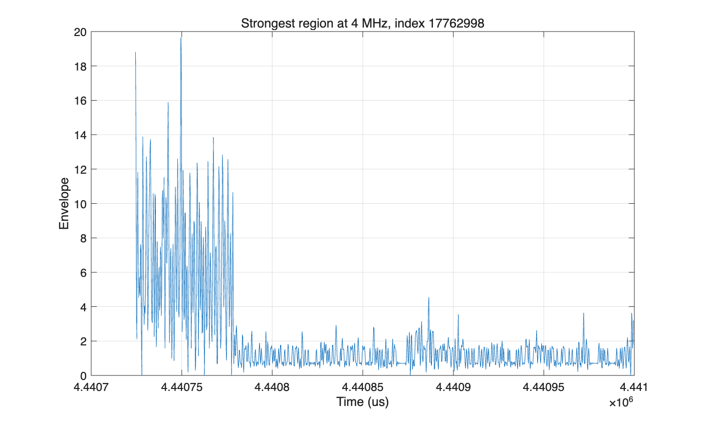
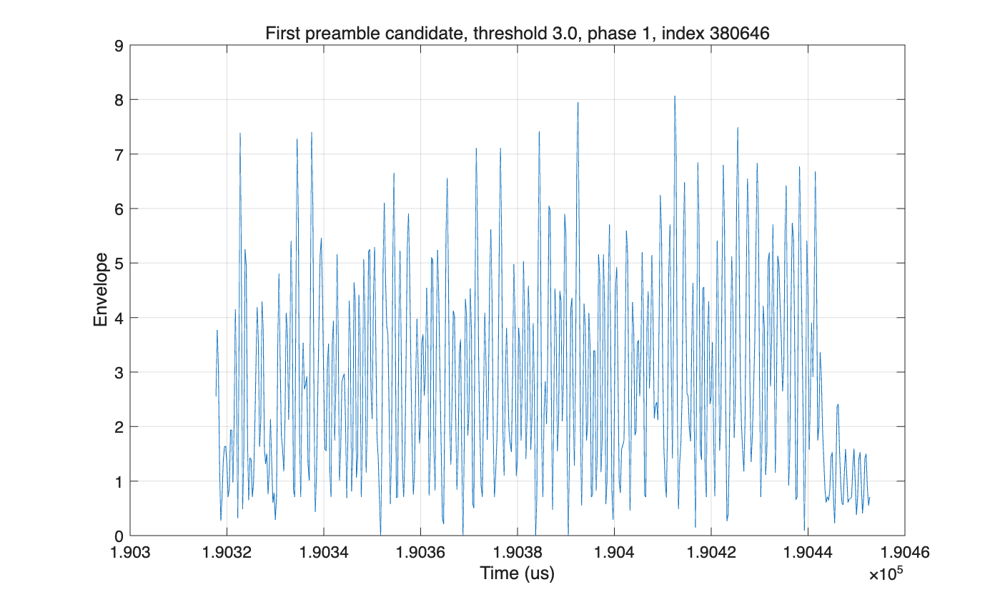

# EE121 Lab 7: ADS-B 信号采集与离线解码实验报告

## 1. 实验目的

本实验目标是使用 RTL-SDR 采集 1090 MHz ADS-B 信号，并在 MATLAB 中完成离线解码。实验主要包括：

1. 从原始 IQ 数据中提取 ADS-B 包络信号；
2. 对包络信号进行重采样和二值化；
3. 利用 ADS-B preamble 定位报文起点；
4. 对 Manchester 编码的数据段进行解码；
5. 提取 DF、ICAO、Type Code 和航班呼号；
6. 使用 Mode-S CRC 校验筛选可信报文。

## 2. 数据采集

本次采集使用 RTL-SDR 在 ADS-B 工作频率 1090 MHz 附近录制原始 IQ 数据。采集命令如下：

```bash
rtl_sdr -f 1090000000 -s 2400000 -g 49.6 -n 24000000 adsb_test_2.4M.iq
```

采集参数如下表所示。

| 参数 | 数值 |
|---|---:|
| 中心频率 | 1090 MHz |
| 原始采样率 | 2.4 MS/s |
| 采样点数 | 24,000,000 complex samples |
| 采集时长 | 10.00 s |
| 数据格式 | unsigned 8-bit interleaved IQ |
| 文件名 | `adsb_test_2.4M.iq` |

采集时通过 tar1090/dump1090 观察到北京附近空域存在多架飞机，说明采集窗口内存在 ADS-B 信号源。实时空域截图如图 1 所示。


## 3. 信号预处理

RTL-SDR 输出的原始数据为交错的 8-bit IQ：

```text
I0, Q0, I1, Q1, ...
```

在 MATLAB 中首先将其转换为以 0 为中心的 IQ 信号：

```matlab
i = raw(1:2:end) - 127.5;
q = raw(2:2:end) - 127.5;
da = sqrt(i.^2 + q.^2);
```

由于 ADS-B 使用 OOK 脉冲调制，后续处理只需要包络幅度 `da`。本次原始包络统计如下：

| 统计量 | 数值 |
|---|---:|
| p50 | 0.71 |
| p90 | 2.12 |
| p99 | 3.81 |
| p99.9 | 8.63 |
| max | 18.51 |

官方实验数据为 3.2 MHz 采样，并通过 `resample(da,5,4)` 重采样到 4 MHz。本次采样率为 2.4 MHz，因此采用：

```matlab
d4 = resample(da, 5, 3);
```

得到 4 MHz 包络信号。4 MHz 下每微秒正好对应 4 个采样点，便于定位 ADS-B preamble 和 Manchester 半比特脉冲。重采样后的统计如下：

| 统计量 | 数值 |
|---|---:|
| p50 | 1.00 |
| p90 | 2.02 |
| p99 | 3.98 |
| p99.9 | 8.53 |
| max | 19.64 |

图 2 为重采样后最强信号附近的包络波形。



## 4. Preamble 检测与二值化

ADS-B 报文前 8 us 为 preamble。根据实验文档，将 4 MHz 包络阈值化后降采样到 2 MHz，并使用如下二值 preamble 搜索报文起点：

```matlab
preamble = [1 0 1 0 0 0 0 1 0 1 0 0 0 0 0 0];
packet_ndx = strfind(db', preamble);
```

官方文档中建议阈值设为 20，但该阈值针对实验提供的 `.mat` 数据幅度标定。本次 `rtl_sdr` 采集文件的包络最大值约为 19.64，因此固定阈值 20 不适用。实验中扫描阈值：

```matlab
thresholdList = [3 4 5 6 7 8 10 15 20];
```

不同阈值下检测到的 preamble candidate 数量如下。

| Threshold | Preamble candidates |
|---:|---:|
| 3 | 325 |
| 4 | 469 |
| 5 | 396 |
| 6 | 292 |
| 7 | 161 |
| 8 | 32 |
| 10 | 1 |
| 15 | 0 |
| 20 | 0 |

可以看到，低阈值能够检测到更多候选包，但也会引入更多误检。因此最终结果不直接使用 preamble candidate 数量，而是进一步通过 Manchester 合法性和 CRC 校验筛选。

图 3 为 threshold = 3 时检测到的第一个 preamble candidate 附近波形。



## 5. Manchester 解码

ADS-B 数据段位于 8 us preamble 之后。每个数据 bit 持续 1 us，在 2 MHz 二值波形中对应 2 个采样点。实验采用如下规则进行 Manchester 解码：

| 二值对 | 数据 bit |
|---|---:|
| `[1 0]` | 1 |
| `[0 1]` | 0 |
| `[0 0]` 或 `[1 1]` | 非法 Manchester pair |

每个长 ADS-B 报文包含 112 bit。解码后提取：

| 字段 | bit 位置 |
|---|---|
| Downlink Format, DF | 1-5 |
| Capability | 6-8 |
| ICAO Address | 9-32 |
| Type Code, TC | 33-37 |
| Callsign data | TC=1-4 时，bit 41 起每 6 bit 一个字符 |

呼号字符表使用官方文档给出的编码：

```matlab
dcd = '#ABCDEFGHIJKLMNOPQRSTUVWXYZ#####_###############0123456789######';
```

## 6. CRC 校验与结果筛选

仅靠 preamble 搜索会产生较多误检，因此本实验使用 Mode-S CRC 对 112-bit 报文进行校验。只有 CRC 通过的报文才被视为可信 ADS-B 报文。

本次实验总体结果如下：

| 项目 | 数量 |
|---|---:|
| 解出的 preamble candidates | 1676 |
| CRC-valid packets | 80 |
| CRC 前唯一 ICAO candidates | 432 |
| CRC 后唯一 ICAO | 8 |
| IDENT-like packets before CRC | 31 |
| CRC-valid IDENT packets | 4 |

CRC 通过后得到的唯一 ICAO 地址如下：

```text
4CAD30
71BF71
780AD0
780CA5
7815D0
781638
782181
782234
```

其中成功解出的 CRC-valid IDENT 报文如下。

| ICAO | Callsign | Raw ADS-B Message |
|---|---|---|
| 782181 | CCA8204 | `8D782181230C3078CB0D2071234C` |
| 7815D0 | CSN6483 | `8D7815D0230D33B6D38CE04918FE` |
| 780CA5 | CES2141 | `8D780CA5230C54F2C74C6047148F` |
| 780CA5 | CES2141 | `8D780CA5230C54F2C74C6047148F` |

去重后，本次采集中成功识别出 3 个唯一航班呼号：

```text
CCA8204
CSN6483
CES2141
```

其中 `CSN6483` 与采集前后 tar1090/dump1090 观测到的中国南方航空航班信息相吻合，说明离线解码结果具有实际可信度。

## 7. 阈值对结果的影响

实验结果表明，阈值选择对 ADS-B 离线解码影响显著。由于本次数据来自 `rtl_sdr` 原始 uint8 IQ 文件，其包络幅度范围与官方 `.mat` 数据不同，因此官方推荐阈值 20 无法直接使用。

当阈值过高时，ADS-B 脉冲会被漏检。例如 threshold = 20 时，检测到的 preamble 数量为 0。当阈值较低时，例如 threshold = 3-6，能够检测到大量 preamble candidate，但其中包含误检，因此需要通过 CRC 进一步筛选。

本次实验中，较有效的阈值范围为 4-7。在该范围内可以解出多个 CRC-valid DF17 报文，并成功得到 ICAO 地址和 IDENT 呼号。

## 8. 结论

本实验完成了从 RTL-SDR 原始 IQ 数据到 ADS-B 报文的完整离线解码流程。主要结论如下：

1. 原始 2.4 MS/s IQ 数据可以通过包络提取和 `resample(da,5,3)` 转换为 4 MHz 包络信号；
2. 4 MHz 采样下每微秒对应 4 个采样点，便于按照官方实验流程进行二值化和 preamble 检测；
3. 固定阈值需要根据实际数据幅度调整，官方 threshold = 20 不适用于本次 uint8 IQ 数据；
4. 单纯 preamble 检测会产生大量误检，必须结合 Manchester 合法性和 Mode-S CRC 筛选；
5. 本次实验共得到 80 个 CRC-valid ADS-B 报文、8 个唯一 ICAO 地址，并成功解出 `CCA8204`、`CSN6483`、`CES2141` 三个唯一航班呼号。

后续若进一步优化天线位置、增益和采集时长，可获得更多 CRC-valid 报文和 IDENT 包，提高航班识别数量。

## 附录：MATLAB 程序

本实验使用的 MATLAB 程序为：

```text
decode_adsb_lab07_official.m
```

程序完成以下功能：

1. 读取 `adsb_test_2.4M.iq`；
2. 将 uint8 IQ 转换为中心化 IQ；
3. 提取 OOK 包络；
4. 重采样到 4 MHz；
5. 多阈值二值化；
6. 使用 `strfind` 搜索 ADS-B preamble；
7. Manchester 解码 112-bit 报文；
8. 提取 DF、ICAO、TC 和 callsign；
9. 使用 Mode-S CRC 筛选可信报文。
