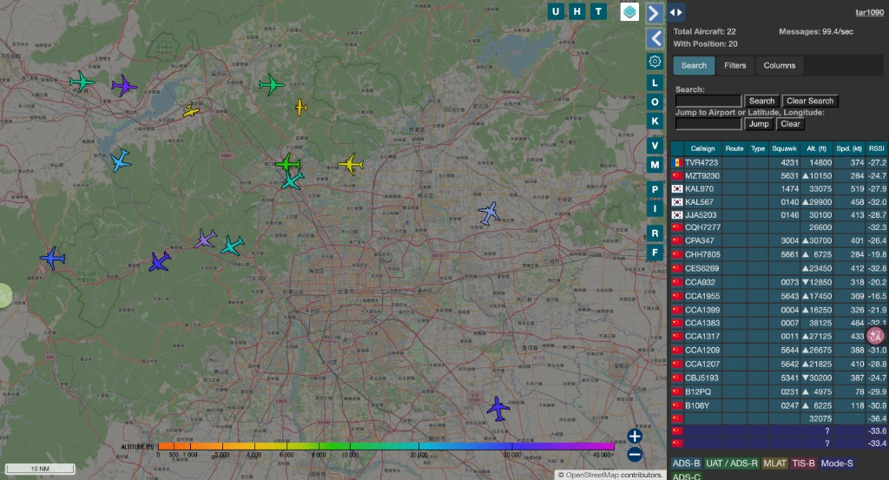
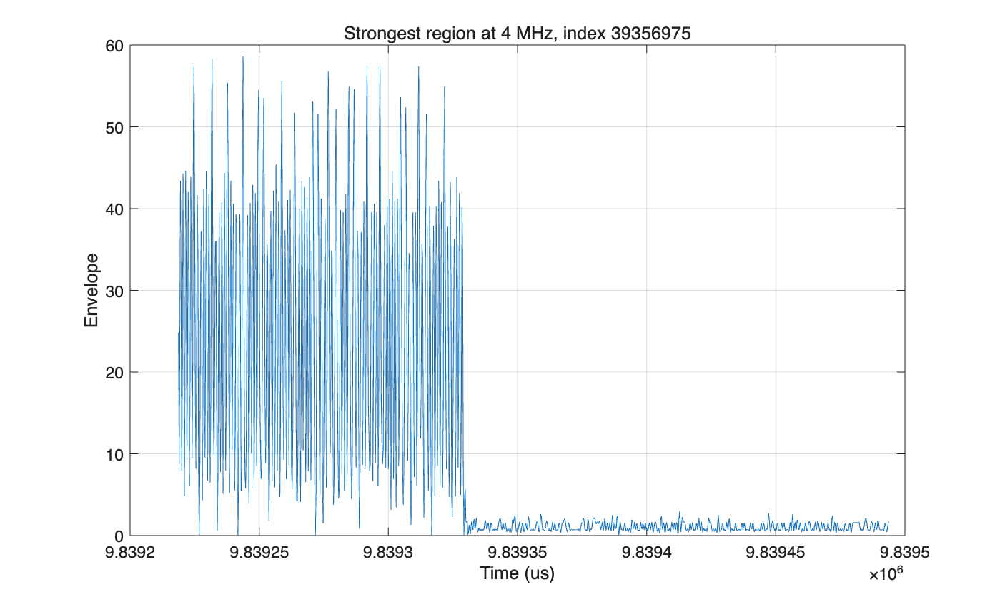
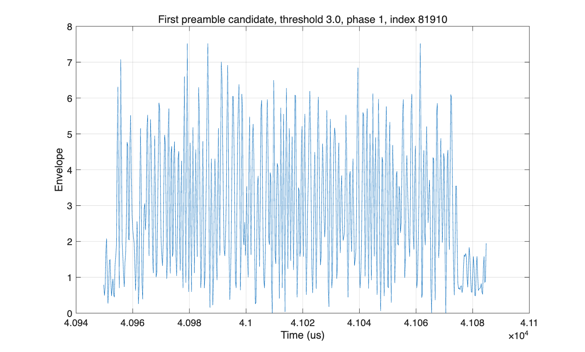

# EE121 Lab 7: ADS-B 信号采集与离线解码实验报告（雷达图 2）

## 1. 实验目的

本实验使用 RTL-SDR 采集 1090 MHz ADS-B 原始 IQ 信号，并在 MATLAB 中按照 EE121 Lab 7 的流程完成离线解码。实验重点是将 MATLAB 解码结果与采集时的 tar1090 雷达图进行对照，验证离线解码得到的 ICAO 地址和航班呼号是否可信。

## 2. 实验环境与采集数据

本次实验使用的采集文件为：

```text
adsb_test_2.4M.iq
```

采集参数如下：

| 参数 | 数值 |
|---|---:|
| ADS-B 工作频率 | 1090 MHz |
| 原始采样率 | 2.4 MS/s |
| 采集点数 | 24,000,000 complex samples |
| 采集时长 | 10.00 s |
| 数据格式 | unsigned 8-bit interleaved IQ |
| MATLAB 解码脚本 | `decode_adsb_lab07_official.m` |

采集期间 tar1090 显示北京附近空域共有约 22 架飞机，其中 20 架带位置，消息率约为 99.4 messages/s。雷达图截图如图 1 所示。



雷达图中可见的航班包括 `CPA347`、`CCA932`、`CCA1399`、`CHH7805`、`CBJ5193` 等，为后续离线解码提供了 ground truth 对照。

## 3. IQ 数据读取与包络提取

RTL-SDR 输出的数据为 8-bit 交错 IQ：

```text
I0, Q0, I1, Q1, ...
```

在 MATLAB 中读取后，先将 IQ 数据以 127.5 为中心归一化到零均值附近：

```matlab
i = raw(1:2:end) - 127.5;
q = raw(2:2:end) - 127.5;
da = sqrt(i.^2 + q.^2);
```

ADS-B 使用 OOK 脉冲调制，因此后续只需要处理包络 `da`。本次原始包络统计如下：

| 统计量 | 数值 |
|---|---:|
| p50 | 0.71 |
| p90 | 1.58 |
| p99 | 5.70 |
| p99.9 | 14.98 |
| max | 55.27 |

与上一组数据相比，本次最大包络幅度明显更高，说明采集中存在更强的 ADS-B 脉冲信号。

## 4. 重采样与波形观察

实验文档建议将包络信号重采样到 4 MHz，使每 1 us ADS-B bit 对应 4 个采样点。由于本次原始采样率为 2.4 MHz，因此采用：

```matlab
d4 = resample(da, 5, 3);
```

重采样后的 4 MHz 包络统计如下：

| 统计量 | 数值 |
|---|---:|
| p50 | 0.91 |
| p90 | 1.85 |
| p99 | 5.67 |
| p99.9 | 14.86 |
| max | 58.56 |

图 2 为 4 MHz 包络中最强信号附近的波形。可以看到该段存在明显的 ADS-B 脉冲串，幅度远高于噪声底。



图 3 为 threshold = 3 时检测到的第一个 preamble candidate 附近波形。该图展示了一个较完整的脉冲序列，可用于报告中说明 preamble 检测后的候选报文形态。



## 5. Preamble 检测与 Manchester 解码

根据 EE121 Lab 7 文档，ADS-B 报文前 8 us 为 preamble。将 4 MHz 包络二值化后降采样到 2 MHz，并使用如下 preamble 模式搜索报文起点：

```matlab
preamble = [1 0 1 0 0 0 0 1 0 1 0 0 0 0 0 0];
packet_ndx = strfind(db', preamble);
```

每个 ADS-B 数据 bit 持续 1 us。在 2 MHz 二值波形中，每个 bit 对应 2 个采样点。Manchester 解码规则如下：

| 二值对 | 解码 bit |
|---|---:|
| `[1 0]` | 1 |
| `[0 1]` | 0 |
| `[0 0]` 或 `[1 1]` | 非法 pair |

解码得到 112 bit 后，提取以下字段：

| 字段 | bit 位置 |
|---|---|
| DF | 1-5 |
| ICAO | 9-32 |
| Type Code | 33-37 |
| Callsign | TC = 1-4 时，从 bit 41 开始按 6 bit 解码 |

呼号解码使用官方文档给出的字符表：

```matlab
#ABCDEFGHIJKLMNOPQRSTUVWXYZ#####_###############0123456789######
```

## 6. 阈值扫描结果

Matlab输出结果：

```
Reading adsb_test_2.4M.iq ...
Raw samples: 24000000, duration 10.00 s
Raw envelope percentiles: p50=0.71, p90=1.58, p99=5.70, p99.9=14.98, max=55.27
4 MHz samples: 40000000, duration 10.00 s
4 MHz envelope percentiles: p50=0.91, p90=1.85, p99=5.67, p99.9=14.86, max=58.56

=== Threshold 3.0 ===
Packets found by preamble: 236
Phase  Index2MHz   DF  ICAO    TC  Manch  CRC  Callsign  Hex
--------------------------------------------------------------------------
    1  81910      17  7802C5  11  0.93     0            8D7802C5589700E93735F9C6DE72
    1  136590      1  614531  19  0.72     0            08614531990C4232D0080A33205A
    1  209055     17  3C1638   3  0.92     0  DCDACD    8D3C163819103101A0300499A090
    1  251159     20  00098E  25  0.79     0            A000098EC9AA5320A18426178C21
    1  253022      1  781230  11  0.78     0            097812305929126120568112450F
    1  431067     20  0010A0  16  0.88     0            A00010A0801AA533BFFCE25E41E0
    1  446997     21  001C9F  24  0.96     0            A8001C9FC2980030AA000043E678
    1  601951     16  7806C5  31  0.84     0            817806C5F80200020001A8E30446
    1  902390     20  001694  31  0.92     0            A0001694FC81020000000049CF5C
    1  1044900    17  781618  19  0.96     0            8D78161899107001C03004552E24
    1  1074753    17  780A94   9  0.91     0            8D780A9448A56254B9556B88A424
    1  1213245    20  0014B4  17  0.80     0            A00014B48A680034A40000BED991
    1  1220861    17  781638  11  0.97     0            8D781638592992E470FB64924102
    1  1522551    21  000025  16  0.93     0            A8000025803F99327FFC9DF07182
    1  1542883    21  00158D  24  0.85     0            A800158DC49624B0A8000004144C
    1  1674760    20  001011  25  0.89     0            A0001011CD2A5A24A14436886C55
    1  1775972    17  380A90  19  0.90     0            8D380A90990C2A87B01006DA0324
    1  2105101    16  780810  10  0.85     0            8178081050854204A5454832D843
    1  2316725    17  61C539  12  0.94     0            8D61C539609BC2807FDD6F5F1577
    1  2427453     1  380800   9  0.72     0            093808004803031E201C1C4A0100
    1  2508130    16  5C1F7B   3  0.82     0            855C1F7B181060011810803208A4
    1  3008079    16  380F7B  11  0.88     0            85380F7B591DE077922707E62010
    1  3152608     1  780894  31  0.89     0            09780894F82100030009B81C533C
    1  3296734    17  71C518   3  0.88     0  CDHJ      8D71C518190C4222F0080A33A04B
    1  3418961    20  0012B2  27  0.98     0            A00012B2DABA4F2FE1AC37348AE1
    1  3456008    21  001C9F  16  0.95     0            A8001C9F801AED23BFFCE2231A1A
    1  3468093    16  781F7B  19  0.96     0            81781F7B98106401580C825E2BAD
    1  3655461    16  E0122C  12  0.76     0            80E0122C609BC2100025369FF0B2
    1  4201414    22  001497  26  0.86     0            B0001497D23A3130616825CA5727
    1  4202123    17  780685  11  0.95     0            8D7806855897257A6251B9F82F79
    1  4288274    20  00133C  31  0.92     0            A000133CF84A312F202C011D1462
    1  4304348     4  00131C  31  0.89     0            2000131CFC4A312F2028011D1472
    1  4339559    16  000D01   0  0.83     0            80000D0100344340600CE1741220
    1  4395265    21  000A01  25  0.82     0            A8000A01C86800B1A400001885C2
    1  4406121     1  781570   1  0.84     0            0D7815700910943370080AC96405
    1  4429498    16  001017  27  0.88     0            80001017DA181630603405066BFD
    1  4508132    17  781F7B  19  0.95     0            8D781F7B99146300580C82530FC3
    1  4516739    17  714539  12  0.85     0            8D714539609BC28059DD675CE419
    1  4556731     1  618530  29  0.79     0            0D618530EA3AA847E51C0808141C
    1  4584561    20  000413  16  0.77     0            A000041380004740000CE5050003

=== Threshold 4.0 ===
Packets found by preamble: 314
Phase  Index2MHz   DF  ICAO    TC  Manch  CRC  Callsign  Hex
--------------------------------------------------------------------------
    1  81910      16  3802C5  11  0.79     0            843802C5589500693214F9C2DC32
    1  187927     20  000519   0  0.99     0            A00005190013B90E000000B41C4C
    1  194576      4  0008B2   4  0.88     0            200008B2202525318A3420A6FA33
    1  209055     17  581628   3  0.91     0  DCDACD    8D58162819103101A0300499A080
    1  235839     17  781578  19  0.95     0            8D7815789910962370040A524A0C
    1  253022     17  781620  11  0.85     0            8D7816205929966120568193450B
    1  371366      4  00109C  18  0.88     0            2000109C940A192C3E2FE0C4B392
    1  446997     21  001C1B   8  0.79     0            A8001C1B428800302A000042C478
    1  629908     17  780A94   1  0.93     0  CVWEB     8D780A94090D6A97B05002DA8322
    1  891987     20  00133C  16  0.96     0            A000133C801F9133BFF8D9AE5102
    1  902390     20  001694  31  0.93     0            A0001694FE81020000000049EF54
    1  952942     20  001694  16  0.96     0            A00016948662032F201C013D3748
    1  1055666    17  480B97  19  0.78     0            8D480B9799093480F82408252371
    1  1068157    20  001486  16  0.81     0            A000148680228572C00CE6C64281
    1  1074753     1  780A94  11  0.96     0            0D780A9458A46250B9556B88A625
    1  1459772    11  781478   8  0.89     0            5D78147844908A8000280609A000
    1  1522551    21  000025  16  0.97     0            A8000025803F99337FFC9DF07182
    1  1542883    21  00158D  24  0.86     0            A800158DC48624B0A0000020145E
    1  1686749    16  C188B3  11  0.99     0            80C188B3584532D151024C1C0FE9
    1  1937028    17  500BE5  29  0.90     0            8D500BE5EA1628500138000D231E
    1  2148343    17  781568  29  0.86     0            89781568EA44A864352C08491301
    1  2316725    17  71C539  12  0.99     1            8D71C539609BC2817FDD6F5F1577
    1  2361889    17  781558  18  0.82     0            8D7815589110942340080A12100C
    1  2443198    20  00133C  23  0.99     0            A000133CBAC80030A800003BE5BD
    1  2459003    20  00033C  16  0.95     0            A000033C803F91336004DD9360C0
    1  2508605    17  780819  19  0.99     1            8D78081999155C8050D80A142532
    1  3265237    17  701558  10  0.84     0            8D70155850A545F9852161943491
    1  3296734    17  71C538   3  0.95     0  CDHJ      8D71C538190C4222F0080A33A04B
    1  3358202     4  00133C  16  0.97     0            2000133C803F91336004DDD37084
    1  3373689    20  00133C  31  0.99     0            A000133CFC4A392F202C011D1472
    1  3389280    20  00133C  23  0.94     0            A000133CBA480030A800003BE5BD
    1  3420711     4  00123C  16  0.95     0            2000123C803F19336004DDD37084
    1  3436282    20  001236  30  0.88     0            A0001236F0423927202C011D1472
    1  3456008    21  001C93   0  0.90     0            A8001C930012E923BFDCE2231A1A
    1  3468093    16  501F7A  19  0.91     0            85501F7A98106401580C825E2BAD
    1  3655461    16  E0133C  12  0.86     0            80E0133C609BC6108025369FF0F2
    1  3701580    16  381318  17  0.83     0            87381318890C7015504002B320E1
    1  3868111    17  781F7B  11  0.92     0            8D781F7B591DE477326703EA1C24
    1  4076422    17  780BF7   9  0.95     0            8D780BF74841F6804C6E19C36420
    1  4202123    16  780685  11  0.86     0            857806855816251A62D1B9F82F69

=== Threshold 5.0 ===
Packets found by preamble: 329
Phase  Index2MHz   DF  ICAO    TC  Manch  CRC  Callsign  Hex
--------------------------------------------------------------------------
    1  143073     20  0008B2   4  0.92     0            A00008B22035A139833C20A6793B
    1  156555     17  71C539  12  1.00     1            8D71C539609BC28125DD7682C702
    1  194576     20  0008B2   4  0.98     0            A00008B22025A539CB3C20A6FB3B
    1  240870      4  0008B2  30  0.88     0            200008B2F77BBF2B4004A7E97CCD
    1  351801     21  0009B8  22  0.93     0            A80009B8B5E80030A400009799D2
    1  371366     20  00109C  18  0.94     0            A000109C944A192C3F2FE0C4B3D2
    1  545249     21  001514  18  0.71     0            A800151490100020A400004B2491
    1  629908     17  380814   1  0.77     0  BVCDB     8938081408096003A04002CA0326
    1  765139     17  780E8F  19  1.00     1            8D780E8F990D279F58440E380939
    1  891987     20  00133C  16  1.00     0            A000133C801F9933BFFCDDAE5902
    1  952942     20  000090  16  0.71     0            A000009086420226200801212340
    1  1055666    17  780BB7  19  0.96     0            8D780BB799093C80F82400252371
    1  1074753     1  380A84   1  0.80     0            0C380A840824205039440B80A201
    1  1180642    20  00128C  10  0.97     0            A000128C564A1D2C3EDFE16D97AD
    1  1332429    17  780819  11  0.92     0            8D7808195807345EE4594B8AE3D5
    1  1449574    20  00133C  16  0.96     0            A000133C803F9923BFFC9D0A2BDA
    1  1522551    21  000125  16  1.00     0            A8000125803F99337FFCDDF07183
    1  1602574    17  780809  25  0.94     0            8D780809CA22A840013808A78526
    1  1937028    17  700AE7  13  0.94     0            8D700AE76A1628580138080D231E
    1  2316725    17  71C539  12  1.00     1            8D71C539609BC2817FDD6F5F1577
    1  2443198    20  00133C  23  1.00     0            A000133CBAC80030A800003BE5BD
    1  2459003    20  00133C  16  1.00     0            A000133C803F99336004DDD370C4
    1  2488999    17  780B76   4  0.86     0  CCA92     8D780B76250C3079CA2820472F12
    1  2812161    17  78068F  17  0.84     0            8D78068F8905279F58440E380919
    1  3041733    17  780BF7  19  0.97     0            8D780BF799093480F824082D2371
    1  3296734    17  71C539  19  0.98     0            8D71C539990C4232F0000233A04B
    1  3358202    20  00133C  16  0.98     0            A000133C803F99336004DDD370C4
    1  3373689    20  00133C  31  1.00     0            A000133CFC4A392F202C011D1472
    1  3389280    20  00133C  23  0.96     0            A000133CBAC80010A800003BE1BC
    1  3420711     4  001234  16  0.94     0            20001234803F19336004DDD37084
    1  3436282    20  001236  30  0.87     0            A0001236F4423827202C011D1472
    1  3655461    16  E1103C   4  0.89     0            80E1103C209BC6109124368FF0F2
    1  3701580    17  781318  17  0.92     0            8F781318890CF895504002B320E1
    1  4076422    17  780BF7   9  0.96     0            8C780BF74841F6804C6E09C36020
    1  4288274    20  00133C  31  1.00     0            A000133CFC4A392F202C011D1472
    1  4304348    20  00133C  31  1.00     0            A000133CFC4A392F202C011D1472
    1  4327195    21  000104   0  0.96     0            A8000104003F99337FFCDDF07183
    1  4328183    17  000000  19  0.80     0            880000009844001080000020430A
    1  4360826    17  680A56  29  0.75     0            8D680A56EA1528500134080D221A
    1  4499993     4  001514  18  0.87     0            2000151497100030A400004A24B1

=== Threshold 6.0 ===
Packets found by preamble: 393
Phase  Index2MHz   DF  ICAO    TC  Manch  CRC  Callsign  Hex
--------------------------------------------------------------------------
    1  135504     16  381444  11  0.88     0            85381444586342B56B04E228F3ED
    1  143073     16  0008B2   4  0.84     0            800008B220348038811C0002703B
    1  156555     17  71C139  12  0.99     0            8D71C139609BC28125DD7682C702
    1  194576     20  0008B2   4  1.00     0            A00008B22035A539CB3C20A6FB3B
    1  240870     20  0018B2  31  0.95     0            A00018B2FF7BFF2B6004B7697DCD
    1  242346     21  000001  20  0.93     0            A8000001A67533F0A80000A9AA7B
    1  262164     21  000C8A   4  0.92     0            A8000C8A22900010280000648CFB
    1  351801     21  0009B8  22  0.97     0            A80009B8B5E80030A400009799D2
    1  371366     20  00129C  18  0.97     0            A000129C944A1D2C3F2FE0C4B3D2
    1  382382     20  00129C  16  0.97     0            A000129C803A36206004D0C154E0
    1  457276      4  0008A2  31  0.78     0            200008A2FD6B7A2A4008A749748D
    1  467844     20  000834  20  0.91     0            A0000834A67D336088000038D2D8
    1  475042     20  28073A  31  1.00     0            A028073AFD3A7F253FC4958979E1
    1  490972     21  280D9A  20  1.00     0            A8280D9AA4880030AA0000EEFAA5
    1  510295     16  200328   2  0.77     0            8020032810030800FD000088589C
    1  520365     20  280C9A   4  0.88     0            A0280C9A200C8237E30D20A7CC38
    1  545249     21  001514  18  0.89     0            A800151497100030A400004B24B1
    1  562676     21  28091A   2  0.96     0            A828091A10030A80FD000066E091
    1  765139     17  780E8F  19  1.00     1            8D780E8F990D279F58440E380939
    1  964965     17  700098  10  0.78     0            8D7000985069140002516F6404A4
    1  1055666    16  7801E3  19  0.90     0            847801E399093C807824002D2371
    1  1123250    17  780BF7  10  0.93     0            8D780BF7504306804C6DECD777D1
    1  1180642    20  00128C  26  0.99     0            A000128CD64A1D2C3EDFE16D97AD
    1  1236585    17  714531  19  0.96     0            8D714531990C4232F0080A23A04B
    1  1332429    17  780819  11  0.99     0            8D7808195807365EE45D4BCAE3D7
    1  1522551    21  000005  16  0.96     0            A8000005803F19337FFCDDF07183
    1  1602574    17  780809  29  0.99     0            8D780809EA22A860013C08A7C526
    1  1802337    20  00129C  26  0.94     0            A000129CD64A1D2C3F1FE1E5DBCA
    1  1937028    17  680AC7   9  0.88     0            8D680AC74A1728580138080D231A
    1  1960672    17  781644  29  0.96     1            8D781644EA269866B93C08778F94
    1  2316725    17  71C539  12  0.99     0            8D71C539609BC2817FDD6F5F1576
    1  2443198    20  00133C   7  0.98     0            A000133C3AC80010A800003BE5BD
    1  2459003    20  00133C  16  0.85     0            A000133C803799236004DD9260C4
    1  2488999    17  780BF6   4  0.88     0  CBA93     8D780BF6250C2079CE28204E2F1A
    1  2740248    17  780C8F  29  0.96     0            8D780C8FEA3608580138080B2074
    1  2812161    17  780E8F  19  0.96     1            8D780E8F990D279F58440E380939
    1  3041733    17  780BF7  19  1.00     1            8D780BF799093C80F824082D2371
    1  3296734    17  708038  17  0.88     0            8D708038880C0022F0000233A049
    1  3358202    20  00133C  16  0.82     0            A000133C803B99236004D9D260C4
    1  3373689    20  00133C  31  0.98     0            A000133CFC48392F202C011D0472

=== Threshold 7.0 ===
Packets found by preamble: 409
Phase  Index2MHz   DF  ICAO    TC  Manch  CRC  Callsign  Hex
--------------------------------------------------------------------------
    1  135504     17  781644  11  0.96     1            8D781644586342BD6B04E228F3ED
    1  156555     17  71C139   4  0.91     0  JI56      8D71C139209BC28025DD76824302
    1  194576     20  0008B2   4  0.99     0            A00008B22035A539CB3C20A6FA3B
    1  240870     20  0008B2  31  0.75     0            A00008B2FD6B6F2A6004B74978CD
    1  242346     21  000001  20  1.00     0            A8000001A67D33F0A80000E9AAFB
    1  262164     17  000C88   0  0.86     0            88000C8802800010200000648479
    1  271720     11  781644  27  0.73     0            5D781644DFCA260007E7C4406020
    1  341750     20  00129C   4  0.97     0            A000129C200822B5879CE0C5B010
    1  351801     21  0009B8  22  0.99     0            A80009B8B5E80030A400009799D2
    1  371366     20  00129C  26  1.00     0            A000129CD64A1D2C3F2FE0C4B3DA
    1  382382     20  00129C  16  0.99     0            A000129C803A37306004D0C154E0
    1  467844     20  000834  20  0.98     0            A0000834A67D33F0A800003CD2D8
    1  475042     20  28073A  31  1.00     0            A028073AFD3A7F253FC4958979E1
    1  489431     20  000C14  16  0.88     0            A0000C14807A6D2D60048D04FE19
    1  490972     21  280D9A  20  1.00     0            A8280D9AA4880030AA0000EEFAA5
    1  510295     16  200318   2  0.82     0            8020031810010000FD000088489C
    1  520365     20  200C9A   4  0.94     0            A0200C9A200C8233E30D20E7CC38
    1  528624     20  000830  16  0.99     0            A000083080340D27400496ACDCF7
    1  545249     21  001514  18  1.00     0            A800151497100030A400004B24F1
    1  562676     21  28099A   0  0.95     0            A828099A00030A80FC000062E090
    1  681442      1  781210  11  0.95     0            0F781210583BA28E53016B15EBF1
    1  695421     17  780898  18  0.92     0            8D780898910D489890500A58085B
    1  765139     17  780E8F  19  1.00     1            8D780E8F990D279F58440E380939
    1  964965     17  780898  10  0.93     0            8D780898506914000251EF6684BC
    1  990388     16  C18830  11  0.95     0            80C18830584306804C6DEC86747A
    1  1081456    17  781210  29  0.96     0            8F781210EA249844013C088BC393
    1  1123250    17  780B77  11  0.99     0            8D780B77584306804C6DECD777D1
    1  1157549    20  00120C  16  0.86     0            A000120C803A37306004CF1E1470
    1  1180642    20  00128C  26  0.99     0            A000128CD64A1D2C3EDFE16D97AD
    1  1332429    17  780819  11  1.00     1            8D7808195847365EE45D4BCAE3D7
    1  1602574    17  780819  29  1.00     1            8D780819EA22A860013C08A7C526
    1  1696762     1  780C90  29  0.91     0            0D780C90EA2A7866853408A7F0DC
    1  1787028    20  001284  22  0.75     0            A0001284B4E80010A40000568074
    1  1802337    20  00129C  26  1.00     0            A000129CD64A1D2C3F1FE1E5DBDA
    1  1946984     4  000835   4  0.71     0            20000835264522E0A800000208C0
    1  1960672    17  781644  29  0.98     1            8D781644EA269866B93C08778F94
    1  2443198     0  00111C   7  0.85     0            0000111C3AC0000020000019E51C
    1  2740248    17  780E8F  29  0.98     1            8D780E8FEA360858013C080F2074
    1  2812161    17  780E8F  19  1.00     1            8D780E8F990D279F58440E380939
    1  3041733    17  780BF7  19  1.00     1            8D780BF799093C80F824082D2371

=== Threshold 8.0 ===
Packets found by preamble: 432
Phase  Index2MHz   DF  ICAO    TC  Manch  CRC  Callsign  Hex
--------------------------------------------------------------------------
    1  22962       0  000D11  23  0.72     0            00000D11BC81020000000082944B
    1  135504     17  781644  11  1.00     1            8D781644586342BD6B04E228F3ED
    1  242346     21  000001  20  1.00     0            A8000001A67D33F0A80000E9AAFB
    1  271720     11  781644  27  0.76     0            5D781644DFCB260007F7C4406030
    1  341750     20  00129C   4  0.99     0            A000129C200822B5C79CE0C5B010
    1  351801     21  0009B8  22  1.00     0            A80009B8B5E80030A400009799D2
    1  357561      0  C188B2  25  0.73     0            02C188B2CD9113C0A30667C30000
    1  371366     20  00129C  26  1.00     0            A000129CD64A1D2C3F2FE0C4B3DA
    1  382382     20  00129C  16  0.99     0            A000129C803A37306004D0C154E0
    1  427224      4  0008B2   4  0.73     0            200008B22035852BE32920208912
    1  437260     21  001C9A  20  0.71     0            A8001C9AA2900020ABC0100000D0
    1  467844     20  000C34  20  1.00     0            A0000C34A67D33F0A800003CD2DC
    1  475042     20  28072A  31  0.97     0            A028072AFD3A7F253FC0958979E1
    1  478637     21  000001  10  0.96     0            A8000001572A412061B4307DA68D
    1  489431     20  000C34  16  0.96     0            A0000C34807A6D2D60049D04FE1B
    1  490972     21  280D9A  20  1.00     0            A8280D9AA4880030AA0000EEFAA5
    1  510295     16  200318   2  0.79     0            80200318100100007C000088488C
    1  520365     20  200498   0  0.85     0            A020049800040013E30520E3CC18
    1  528624     16  000830  16  0.97     0            8000083080140D27400496ACDCF7
    1  530621     20  28073A  31  1.00     0            A028073AFE81C300000000954A72
    1  545249     21  001514  18  1.00     0            A800151497100030A400004B24F1
    1  562676     21  080182   0  0.86     0            A808018200010A007C0000226000
    1  681442      1  781210  11  0.97     0            0F781210583BA2CE5B116B15EBF1
    1  695421     17  780898  19  0.98     0            8D780898990D489890500A580C5B
    1  765139     17  780E8F  19  1.00     1            8D780E8F990D279F58440E380939
    1  964965     17  780C98  11  0.97     0            8D780C98586914300251EF7684BC
    1  990388     16  C18830  11  0.98     0            80C18830584306804C6DEC86747A
    1  1081456    17  781210  29  0.97     0            8F781210EA249844013C088BC39B
    1  1123250    17  780B77  11  0.99     0            8D780B77584306804C6DECD777D1
    1  1157549    20  00120C  16  0.92     0            A000120C803A37306004CF1E1470
    1  1180642    20  00128C  26  0.99     0            A000128CD64A1D2C3EDFE16D97AD
    1  1332429    17  780819  11  1.00     1            8D7808195847365EE45D4BCAE3D7
    1  1602574    17  780819  29  1.00     1            8D780819EA22A860013C08A7C526
    1  1696762     1  780C98  29  0.98     0            0D780C98EA2A7866C53C08A7F0DE
    1  1787028    20  00128C   6  0.83     0            A000128C35E80010A40000528074
    1  1802337    20  00129C  26  1.00     0            A000129CD64A1D2C3F1FE1E5DBDA
    1  1946984    20  000835  20  0.88     0            A0000835A66D23E0A800004208E2
    1  1960672    17  781644  29  1.00     1            8D781644EA269866B93C08778F94
    1  2137643    17  701444  10  0.90     0            8D701444506252BD410484298C23
    1  2681542    17  781318   3  0.93     0  NKFNQES   8F781318183BB2C6391153F03AEC

=== Threshold 10.0 ===
Packets found by preamble: 386
Phase  Index2MHz   DF  ICAO    TC  Manch  CRC  Callsign  Hex
--------------------------------------------------------------------------
    1  22962       4  000D11  31  0.92     0            20000D11FE81030000000082D64B
    1  135504     17  781644  11  1.00     1            8D781644586342BD6B04E228F3ED
    1  242346     21  000001  20  1.00     0            A8000001A67D33F0A80000E9AAFB
    1  271720     11  781644  27  0.73     0            5D781644DFCB26A083B3E2283012
    1  341750     20  00129C   4  0.96     0            A000129C200C22B5C79CE0C5B010
    1  351801     21  0009B8  22  1.00     0            A80009B8B5E80030A400009799D2
    1  371366     20  00129C  26  1.00     0            A000129CD64A1D2C3F2FE0C4B3DA
    1  382382     20  00129C  16  0.99     0            A000129C803A37306004D0C154E0
    1  467844     20  000C34  20  0.97     0            A0000C34A67D33F0A800003CD2DC
    1  478637     21  000001  26  0.95     0            A8000001D72A412461B4307DA48D
    1  489431     20  000C34   0  0.94     0            A0000C34001A6D2D60043D04FE0B
    1  490972      5  280D92   4  0.93     0            28280D92248800302A0000EEBAA1
    1  520365     16  000488   0  0.75     0            8000048800040013E1042063C418
    1  530621     20  280722  27  0.92     0            A0280722DC81C200000000954A72
    1  545249     20  001514  18  0.91     0            A000151496100030A400004B24E1
    1  681442     17  781318  11  1.00     1            8F781318583BA2CE5B116B15EBF1
    1  695421     17  780C98  19  1.00     1            8D780C98990D4C9890500A580C5B
    1  765139     17  780E8F  19  1.00     1            8D780E8F990D279F58440E380939
    1  964965     17  780C98  11  1.00     1            8D780C98586916300251EF7684BC
    1  990388     16  C18830  11  0.99     0            80C18830584306804C6DEC86747A
    1  1081456    17  781318  29  1.00     1            8F781318EA249864013C088BC39B
    1  1123250    17  780A77  11  0.97     0            8D780A77584306804C6DECD777D1
    1  1157549    16  00108C  16  0.84     0            8000108C801A37102000470E0430
    1  1180642    20  00129C  26  1.00     0            A000129CD64A1D2C3EDFE16D97AD
    1  1332429    17  780819  11  1.00     1            8D7808195847365EE45D4BCAE3D7
    1  1372011    16  380687  28  0.88     0            85380687E008980000000031FA90
    1  1602574    17  780819  29  0.99     0            8D780819EA22A860013C08A78526
    1  1682776    24  40840F   1  0.73     0            C040840F0800F071001922100F12
    1  1696762    17  780C98  29  1.00     1            8D780C98EA2A7866C53C08A7F8DE
    1  1802337    20  00129C  10  0.96     0            A000129C564A1D2C3F0FE0E1DBDA
    1  1882546    20  0008B4  22  0.72     0            A00008B4B0800000002000108C0A
    1  1946984    20  000835  20  0.93     0            A0000835A67D3341A800004208FE
    1  1960672    17  781644  29  1.00     1            8D781644EA269866B93C08778F94
    1  2137643    17  781644  11  1.00     1            8D781644586352BD4104C429CC33
    1  2500160    16  781240   1  0.81     0            847812400895039A30200BC84020
    1  2681542    17  781108   3  0.86     0  F9AFFC    8F781108181B9046180003F01AEC
    1  2740248    17  780E8F  29  0.97     0            8D780E8FEA360858013C080F2064
    1  2806868     0  3C0408   1  0.78     0            053C040808044008000C09EF8010
    1  2812161    17  780E87  19  0.97     0            8D780E87990D279F58440E180938
    1  3686459    16  C1881F  11  1.00     0            80C1881F5841F6804C6E19384864

=== Threshold 15.0 ===
Packets found by preamble: 51
Phase  Index2MHz   DF  ICAO    TC  Manch  CRC  Callsign  Hex
--------------------------------------------------------------------------
    1  681442     17  781318  11  0.99     0            8F781318583BA2CE53116B15EBF1
    1  1081456     1  701218  28  0.78     0            0E701218E2249844013C088BC313
    1  5254752    20  28062C  31  0.84     0            A028062CF9327625AD0896944094
    1  5275898    21  280D9A  20  1.00     0            A8280D9AA4880030AA0000EEFAA5
    1  6856441    21  000001  16  0.96     0            A8000001803A6D2D2004BE997791
    1  6857241    21  000001  20  0.96     0            A8000001A47D33F0A00000E9AAFB
    1  8212067     0  000430  10  0.72     0            0000043051024006A18000DC1E41
    1  8462138    20  28073D  26  1.00     0            A028073DD6DA011DA0DC1B753BBA
    1  8478078    21  08058A  31  0.88     0            A808058AFE0A3501FFD417D4140D
    1  8478878    21  280D9A  20  0.97     0            A8280D9AA00800302A0000EEFAA5
    1  8492105    20  08010D   0  0.76     0            A008010D000002003D000005025A
    1  8500393     0  781644   3  0.92     0            057816441911289A90640A13D4A5
    1  9611506    17  780E8F  30  0.93     0            8D780E8FF02300030049A818C560
    1  11061891   17  781310  29  0.99     0            8F781310EA249864013C088BC39B
    1  12273319    0  00031E   8  0.76     0            0000031E4218000CE060081064C0
    1  12289281   16  280D9A  31  0.81     0            80280D9AFE3870021FCC08180110
    1  12290081   21  28059A  20  0.92     0            A828059AA48000102200006E7A84
    1  12310699   21  280D9A  20  0.98     0            A8280D9AA4880030AA0000EEF8A5
    1  12378450   16  41873E  11  0.97     0            8041873E583BE25B126B819FD8DD
    1  12428009    4  001290  26  0.77     0            20001290D64A152A7EBF00463968
    1  12462724   16  C1873E  11  1.00     0            80C1873E583BE2CD8D10DAD49645
    1  13211181   16  080588  16  0.82     0            80080588808800108A0000667880
    1  13674218   17  7803F7  19  0.96     0            8D7803F799093C80F82008252361
    1  16282076   17  781318  31  1.00     1            8F781318F82300060049B8DA2E9F
    1  16402638   20  28073F  20  1.00     0            A028073FA4880030AA000068850B
    1  16412553   21  08048A  26  0.84     0            A808048AD62A001E00540A90817B
    1  18702172    1  701218  11  0.95     0            0B701218583D02CD1D1089E182D3
    2  2193158     1  780BF7  19  0.89     0            0D780BF799093880F02408282271
    2  3106125    17  780BF7  11  1.00     1            8D780BF75841F6804C6E0BC398E1
    2  6381664    17  781318  11  1.00     1            8F781318583BC65B9A6BCADA1606
    2  6802301    16  000C37  26  0.98     0            80000C37D72A4326A19C31FC85AF
    2  6818375    20  000C37  26  0.97     0            A0000C37D72A4126A11C31FC85AF
    2  8439996    21  000001   4  0.80     0            A8000001246123F0880000C92AFB
    2  8471121    20  28073D  31  1.00     0            A028073DFE1A7525FFD497AFFDC7
    2  8478077    21  280D9A  31  0.99     0            A8280D9AFE1A7525FFD497D43629
    2  8478877    21  28099A  20  0.96     0            A828099AA4880030AA0000EEBAA5
    2  8492104    20  280525   2  0.80     0            A028052510020A80AD0000152A7A
    2  8977376    17  780E8B   3  0.92     0  CRYVDPN   8D780E8B190D279958440E200939
    2  9065786     0  000018   2  0.78     0            0000001811E000000000000C0017
    2  9861831    17  781318  19  1.00     1            8F781318990CF995F03806CD2AB0

=== Threshold 20.0 ===
Packets found by preamble: 10
Phase  Index2MHz   DF  ICAO    TC  Manch  CRC  Callsign  Hex
--------------------------------------------------------------------------
    1  8462138     4  28073D  26  0.91     0            2028073DD6DA011DA0D81B753338
    1  11061891   17  781318  29  1.00     1            8F781318EA249864013C088BC39B
    1  12310699   21  280D1A  20  0.81     0            A8280D1AA48000000200000EF025
    1  16282076   17  781318  31  1.00     1            8F781318F82300060049B8DA2E9F
    2  6381664    17  781118   3  0.93     0  NXYB      8F781118183BC6198A6BC2DA1404
    2  8341844    17  781318  11  1.00     1            8F781318583BD65B786BB129A8C4
    2  11061891   16  380908  12  0.78     0            8738090860008820001C0001C189
    2  12289280    5  280D9A  25  0.72     0            28280D9ACE7261243ED890504525
    2  19578651   16  C18790  11  1.00     0            80C18790583D065AB26B29F842EE
    2  19678418   16  C18790  11  1.00     0            80C18790583D02CD0B1080B1B070

=== Overall ===
All preamble candidates decoded: 2560
CRC-valid packets: 241
Unique ICAO candidates before CRC: 719
Unique ICAO after CRC: 9
71C539 780819 780A94 780BF7 780C98 780E8F 781318 781578 781644
IDENT-like packets before CRC: 82
CRC-valid IDENT packets decoded: 8
ICAO 780A94  Callsign CPA347  Hex 8D780A94250D0073D378203AE926
ICAO 780BF7  Callsign CCA932  Hex 8D780BF7250C3079CF282047AF1A
ICAO 780E8F  Callsign CBJ5193  Hex 8D780E8F230C22B5C79CE00ED5A6
ICAO 780BF7  Callsign CCA932  Hex 8D780BF7250C3079CF282047AF1A
ICAO 781318  Callsign CHH7805  Hex 8F781318250C8237E30D60AE6D24
ICAO 781644  Callsign CCA1399  Hex 8D781644230C3071CF9E60F8EA7C
ICAO 780BF7  Callsign CCA932  Hex 8D780BF7250C3079CF282047AF1A
ICAO 781644  Callsign CCA1399  Hex 8D781644230C3071CF9E60F8EA7C
>> 
```


由于本次数据来自实际 `rtl_sdr` 原始 IQ 文件，其幅度标定与官方 `.mat` 数据不同，因此实验扫描了多个二值化阈值：

```matlab
thresholdList = [3 4 5 6 7 8 10 15 20];
```

不同阈值下检测到的 preamble candidate 数量如下：

| Threshold | Preamble candidates |
|---:|---:|
| 3 | 236 |
| 4 | 314 |
| 5 | 329 |
| 6 | 393 |
| 7 | 409 |
| 8 | 432 |
| 10 | 386 |
| 15 | 51 |
| 20 | 10 |

本次信号较强，因此即使 threshold = 20 也仍能检测到 10 个候选报文；而上一组较弱数据在 threshold = 20 时没有检测到有效候选。这说明本次采集的信噪比明显改善。

## 7. CRC 校验与可信报文筛选

单纯 preamble 检测会产生误检，因此最终只将 Mode-S CRC 校验通过的报文作为可信 ADS-B 报文。本次总体统计结果如下：

| 项目 | 数量 |
|---|---:|
| 解出的 preamble candidates | 2560 |
| CRC-valid packets | 241 |
| CRC 前唯一 ICAO candidates | 719 |
| CRC 后唯一 ICAO | 9 |
| IDENT-like packets before CRC | 82 |
| CRC-valid IDENT packets | 8 |

CRC 通过后得到的唯一 ICAO 地址为：

```text
71C539
780819
780A94
780BF7
780C98
780E8F
781318
781578
781644
```

其中成功解出的 CRC-valid IDENT 报文如下：

| ICAO | Callsign | Raw ADS-B Message |
|---|---|---|
| 780A94 | CPA347 | `8D780A94250D0073D378203AE926` |
| 780BF7 | CCA932 | `8D780BF7250C3079CF282047AF1A` |
| 780E8F | CBJ5193 | `8D780E8F230C22B5C79CE00ED5A6` |
| 780BF7 | CCA932 | `8D780BF7250C3079CF282047AF1A` |
| 781318 | CHH7805 | `8F781318250C8237E30D60AE6D24` |
| 781644 | CCA1399 | `8D781644230C3071CF9E60F8EA7C` |
| 780BF7 | CCA932 | `8D780BF7250C3079CF282047AF1A` |
| 781644 | CCA1399 | `8D781644230C3071CF9E60F8EA7C` |

去重后，本次实验成功识别出 5 个唯一航班呼号：

```text
CPA347
CCA932
CBJ5193
CHH7805
CCA1399
```

## 8. 与雷达图 2 的对照验证

将 MATLAB 离线解码结果与 tar1090 雷达图 2 对照，可以看到多个航班呼号完全匹配：

| MATLAB 解码呼号 | 是否出现在雷达图 2 | 说明 |
|---|---|---|
| CPA347 | 是 | 雷达图右侧列表中可见 |
| CCA932 | 是 | 雷达图右侧列表中可见 |
| CBJ5193 | 是 | 雷达图右侧列表中可见 |
| CHH7805 | 是 | 雷达图右侧列表中可见 |
| CCA1399 | 是 | 雷达图右侧列表中可见 |

该对照结果说明 MATLAB 离线解码得到的 IDENT 报文与实时 ADS-B 监测结果一致，证明了解码流程的正确性。

本次实验中，`CCA932`、`CCA1399` 等航班在雷达图中信号较强，且 MATLAB 解码中多次出现相同的 CRC-valid IDENT 报文，进一步增强了结果可信度。

## 9. 结果分析

本次实验相较上一组数据有三个明显改进：

1. **信号幅度更高**：4 MHz 包络最大值达到 58.56，上一组约为 19.64；
2. **CRC-valid 报文更多**：本次得到 241 个 CRC-valid packets；
3. **雷达图对照更充分**：离线解码出的 5 个唯一呼号均能在 tar1090 雷达图 2 中找到对应项。

阈值扫描也显示，低阈值会产生更多 preamble candidate，但不一定代表更多可信报文；必须通过 CRC 校验筛选。对于本次数据，threshold = 7-10 区间既能检测较多候选，也能保留较多 CRC-valid 报文，是较合适的处理范围。

## 10. 结论

本次实验成功完成了 ADS-B 原始 IQ 信号的离线解码，并通过 tar1090 雷达图 2 对结果进行了验证。主要结论如下：

1. 使用 RTL-SDR 采集的 2.4 MS/s 原始 IQ 数据可以通过包络提取和 `resample(da,5,3)` 转换为适合解码的 4 MHz 包络信号；
2. 基于官方 preamble 模式的 `strfind` 检测能够定位 ADS-B 报文候选；
3. Manchester 解码结合 Mode-S CRC 校验可以有效剔除误检报文；
4. 本次共得到 241 个 CRC-valid ADS-B 报文和 9 个唯一 ICAO 地址；
5. 成功解出 `CPA347`、`CCA932`、`CBJ5193`、`CHH7805`、`CCA1399` 5 个唯一航班呼号；
6. 上述呼号均能在采集时的 tar1090 雷达图 2 中找到对应记录，验证了离线解码结果的准确性。

因此，本次实验较完整地实现了从真实无线电采集、数字信号处理、ADS-B 报文定位、Manchester 解码、CRC 校验到航班呼号识别的全过程。

## 附录：使用文件

| 文件 | 说明 |
|---|---|
| `adsb_test_2.4M.iq` | 本次 RTL-SDR 原始 IQ 采集数据 |
| `decode_adsb_lab07_official.m` | MATLAB 离线解码程序 |
| `解码2的输出` | 本次 MATLAB 解码终端输出 |
| `雷达图2.jpeg` | 本次采集对应的 tar1090 雷达图 |
| `雷达2的图1.png` | 最强 4 MHz 包络波形图 |
| `雷达图2的图2.png` | 第一个 preamble candidate 附近波形图 |
