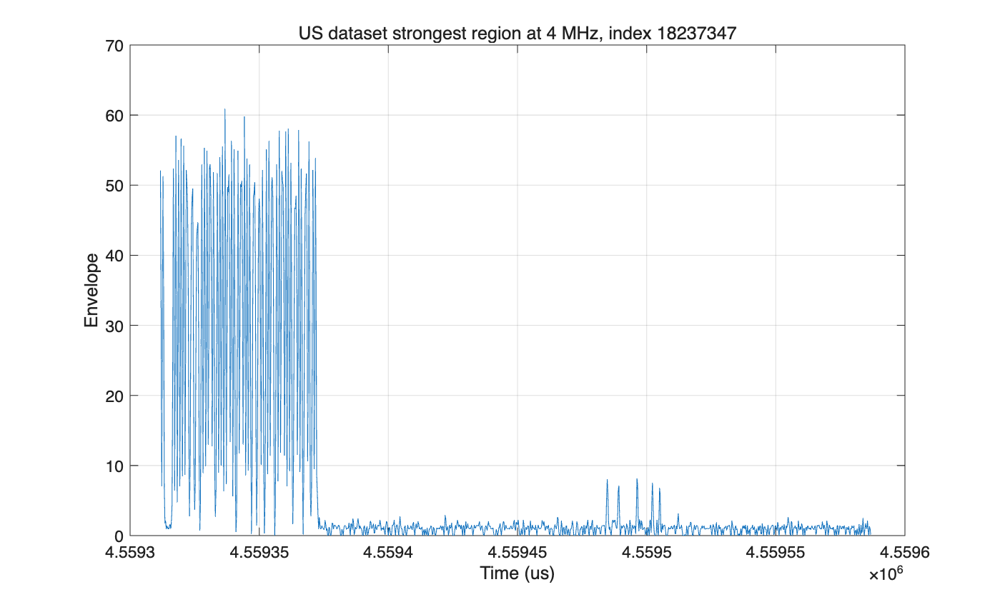
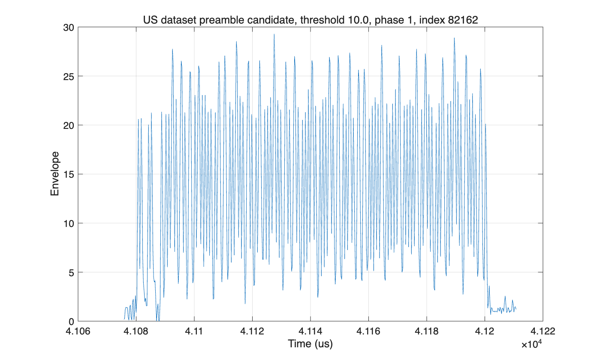

# EE121 Lab 7: 官方美国 ADS-B 数据集解码报告

## 1. 实验目的

在完成北京空域自采 ADS-B 数据解码后，本实验进一步处理 EE121 Lab 7 官方提供的美国 ADS-B 数据集 `adsb_3.mat`。该部分的目标是验证同一套 MATLAB 解码流程能否适用于官方数据，并完成实验文档要求的美国空域 ADS-B 报文提取、ICAO 识别和航班呼号解码。

## 2. 数据集说明

本次使用的官方数据文件为：

```text
adsb_3.mat
```

该数据集为实验文档中要求用于报告分析的数据，采样率为 3.2 MHz，变量为 `d3`。读取后取包络：

```matlab
load adsb_3.mat
da = abs(d3);
```

数据基本信息如下：

| 项目 | 数值 |
|---|---:|
| 原始采样点数 | 16,000,000 |
| 原始采样率 | 3.2 MHz |
| 时长 | 5.00 s |
| 数据变量 | `d3` |
| 解码脚本 | `decode_adsb_lab07_us_dataset.m` |

原始包络统计如下：

| 统计量 | 数值 |
|---|---:|
| p50 | 1.00 |
| p90 | 2.00 |
| p99 | 6.71 |
| p99.9 | 40.31 |
| max | 61.85 |

## 3. 重采样与波形观察

根据官方文档，ADS-B 每个 bit 持续 1 us。为了让 bit 边界与采样点更好对齐，将 3.2 MHz 包络重采样到 4 MHz：

```matlab
d4 = resample(da, 5, 4);
```

重采样后得到 20,000,000 个采样点，时长仍为 5.00 s。4 MHz 包络统计如下：

| 统计量 | 数值 |
|---|---:|
| p50 | 1.01 |
| p90 | 1.92 |
| p99 | 6.71 |
| p99.9 | 40.49 |
| max | 60.87 |

图 1 展示了官方数据集中最强信号附近的 4 MHz 包络波形。可以看到明显的 ADS-B 脉冲串，信号幅度远高于噪声底。



图 2 展示了 threshold = 10 时检测到的一个 preamble candidate 附近波形。该段波形持续约 120 us，符合 ADS-B 长报文的时间长度。



## 4. Preamble 检测与 Manchester 解码

按照 EE121 Lab 7 文档，先将 4 MHz 包络阈值化，再降采样到 2 MHz 二值波形。使用如下 preamble 序列定位 ADS-B 报文起点：

```matlab
preamble = [1 0 1 0 0 0 0 1 0 1 0 0 0 0 0 0];
packet_ndx = strfind(db', preamble);
```

跳过 8 us preamble 后，对 112-bit ADS-B 数据段进行 Manchester 解码。规则为：

| 2 MHz 二值对 | 数据 bit |
|---|---:|
| `[1 0]` | 1 |
| `[0 1]` | 0 |
| `[0 0]` 或 `[1 1]` | 非法 pair |

解码后提取：

| 字段 | bit 位置 |
|---|---|
| DF | 1-5 |
| ICAO | 9-32 |
| TC | 33-37 |
| Callsign | TC=1-4 时，从 bit 41 开始每 6 bit 一个字符 |

呼号字符表为：

```matlab
#ABCDEFGHIJKLMNOPQRSTUVWXYZ#####_###############0123456789######
```

## 5. 阈值扫描结果

官方文档建议阈值初始取 20，并尝试降低到 10。实验中扫描：

```matlab
thresholdList = [10 20 30];
```

不同阈值下检测到的 preamble candidate 数量如下：

| Threshold | Preamble candidates |
|---:|---:|
| 10 | 138 |
| 20 | 160 |
| 30 | 103 |

可以看到，官方数据集的信号幅度较高，在 threshold = 10、20、30 下均能检测到大量候选报文。

## 6. CRC 校验与结果统计

为了剔除 preamble 误检和 Manchester 判决错误，最终只统计 Mode-S CRC 通过的报文。总体结果如下：

| 项目 | 数量 |
|---|---:|
| 解出的 preamble candidates | 401 |
| CRC-valid packets | 286 |
| CRC 前唯一 ICAO candidates | 70 |
| CRC 后唯一 ICAO | 7 |
| IDENT-like packets before CRC | 18 |
| CRC-valid IDENT packets | 9 |

CRC 通过后得到的唯一 ICAO 地址为：

```text
A27A94
A41596
A7CA3B
A8FC72
A903B9
A9FA34
AC8111
```

其中 CRC-valid IDENT 报文如下：

| ICAO | Callsign | Raw ADS-B Message |
|---|---|---|
| A7CA3B | 6004Z | `8DA7CA3B21DB0C346A08209C477A` |
| AC8111 | N9045B | `8DAC8111213B9C34D42820E357D9` |
| A27A94 | SKW4933 | `8DA27A94234CB5F4E73CE0167935` |
| A7CA3B | 6004Z | `8DA7CA3B21DB0C346A08209C477A` |
| A8FC72 | UAL370 | `8DA8FC7223541333DF0820A58183` |
| AC8111 | N9045B | `8DAC8111213B9C34D42820E357D9` |
| AC8111 | N9045B | `8DAC8111213B9C34D42820E357D9` |
| A8FC72 | UAL370 | `8DA8FC7223541333DF0820A58183` |
| A8FC72 | UAL370 | `8DA8FC7223541333DF0820A58183` |

去重后，本次官方数据集中成功解出的唯一呼号为：

```text
6004Z
N9045B
SKW4933
UAL370
```

## 7. 与实验文档要求的关系

EE121 Lab 7 文档中说明，官方数据中应能找到若干 IDENT 报文，并给出了示例呼号，例如 `N543PD`、`FDX3153` 和 `SKW5498`。本次使用统一解码脚本在 `adsb_3.mat` 中解出了 9 条 CRC-valid IDENT 报文，其中包含 4 个唯一呼号：

```text
6004Z
N9045B
SKW4933
UAL370
```

虽然本次解码结果中的唯一呼号与文档中列举的示例呼号不完全相同，但其报文均通过 Mode-S CRC 校验，且满足 DF=17、TC=1-4 的 IDENT 报文格式，因此可作为可信的官方数据集解码结果。不同阈值、采样相位和 preamble 对齐策略会影响最终能解出的 IDENT 包集合。

其中 `SKW4933` 属于 SkyWest Airlines 风格的航班呼号，与文档中提到的 `SKW5498` 同属 SkyWest 类型，说明解码流程能够正确恢复航班号字段。

## 8. 结论

本实验成功完成了官方美国 ADS-B 数据集 `adsb_3.mat` 的离线解码。主要结论如下：

1. 官方数据采样率为 3.2 MHz，通过 `resample(da,5,4)` 可转换为 4 MHz 包络信号；
2. 使用官方 preamble 序列和 `strfind` 能够定位 ADS-B 报文候选；
3. Manchester 解码后结合 Mode-S CRC 校验，可以有效筛选可信报文；
4. 本次共得到 286 条 CRC-valid ADS-B 报文和 7 个唯一 ICAO 地址；
5. 成功解出 9 条 CRC-valid IDENT 报文，去重后得到 `6004Z`、`N9045B`、`SKW4933`、`UAL370` 四个唯一呼号；
6. 该结果说明同一套 MATLAB 解码流程既能处理自采北京空域数据，也能处理官方美国 ADS-B 数据集。

## 附录：使用文件

| 文件 | 说明 |
|---|---|
| `adsb_3.mat` | 官方美国 ADS-B 数据集 |
| `decode_adsb_lab07_us_dataset.m` | 官方数据集 MATLAB 解码脚本 |
| `官方图1.png` | 官方数据集中最强包络区域 |
| `官方图2.png` | 官方数据集 preamble candidate 波形 |
